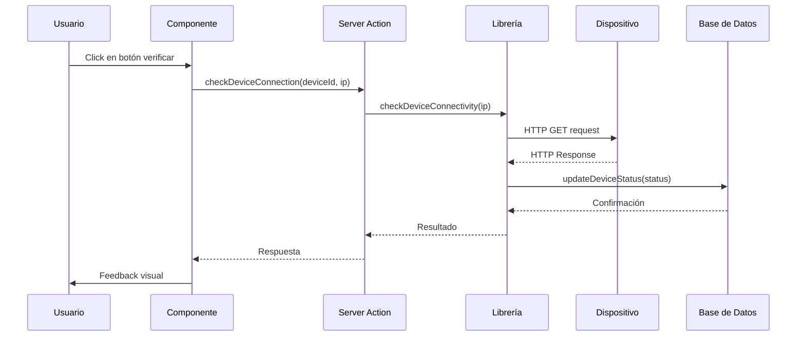
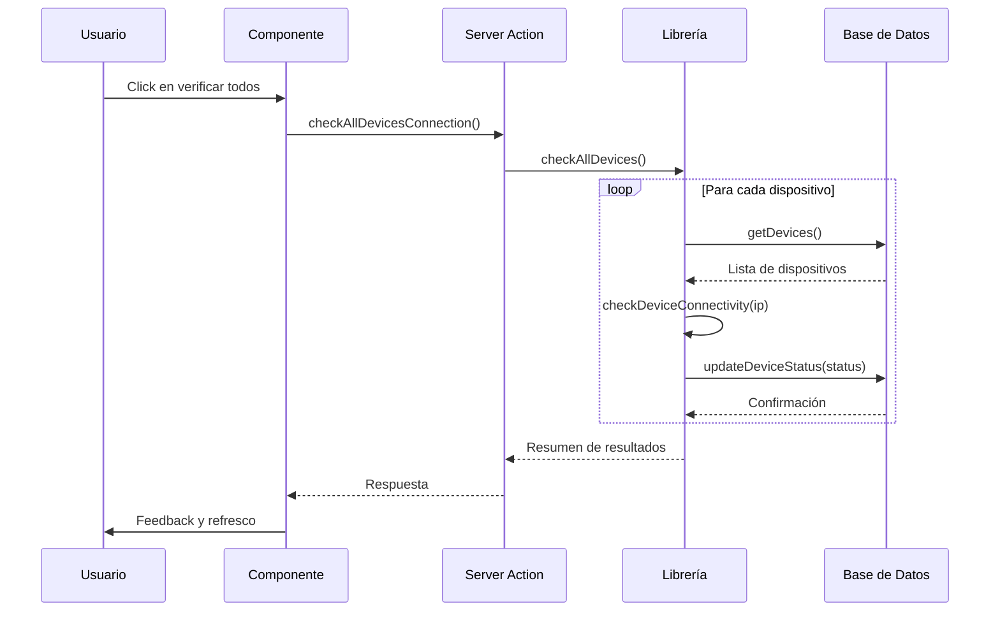

# API y Endpoints del Sistema de Conectividad

Documentación técnica de las APIs y endpoints implementados para el sistema de conectividad.

## Endpoints Server Actions

### `POST /actions/device-connectivity/checkDeviceConnection`

Verifica la conectividad de un dispositivo específico.

**Parámetros:**
```typescript
deviceId: string  // UUID del dispositivo
ipAddress: string // Dirección IP del dispositivo
```

**Respuesta Exitosa:**
```json
{
  "success": true,
  "result": {
    "status": "online" | "offline" | "checking" | "error",
    "latency": 45, // milisegundos
    "timestamp": "2026-04-15T15:30:00.000Z"
  }
}
```

**Respuesta con Error:**
```json
{
  "success": false,
  "error": "Timeout - Dispositivo no responde"
}
```

**Uso Interno:**
- Llamado por el componente `DeviceCard` al presionar el botón de verificación
- Actualiza automáticamente el estado en la base de datos
- Invalida el caché de la página de dispositivos

### `POST /actions/device-connectivity/checkAllDevicesConnection`

Verifica la conectividad de todos los dispositivos registrados.

**Parámetros:**
```typescript
// Sin parámetros requeridos
```

**Respuesta Exitosa:**
```json
{
  "success": true,
  "results": {
    "total": 5,
    "online": 4,
    "offline": 1,
    "errors": 0,
    "results": [
      {
        "deviceId": "uuid-here",
        "result": {
          "status": "online",
          "latency": 32,
          "timestamp": "2026-04-15T15:30:00.000Z"
        }
      }
    ]
  }
}
```

**Uso Interno:**
- Llamado por el componente `ConnectivityCheckButton`
- Llamado por la página de conectividad
- Actualiza estado de todos los dispositivos
- Refresca dashboard automáticamente

### `POST /actions/device-connectivity/scheduledHealthCheck`

Endpoint para tareas programadas de verificación.

**Parámetros:**
```typescript
// Sin parámetros requeridos
```

**Respuesta Exitosa:**
```json
{
  "success": true,
  "message": "Health check completado: 4 online, 1 offline, 0 errores"
}
```

**Uso Externo:**
- Llamado por cron jobs externos
- Llamado por servicios de monitoreo
- Uso en GitHub Actions

## Endpoints HTTP API

### `GET /api/check-connectivity`

API pública para verificación programada.

**Headers Requeridos:**
```http
Authorization: Bearer ${CRON_AUTH_TOKEN}
```

**Respuesta Exitosa:**
```json
{
  "success": true,
  "message": "Health check completado: 4 online, 1 offline, 0 errores",
  "results": [
    // Array de resultados individuales
  ]
}
```

**Respuesta de Autenticación Fallida:**
```http
401 Unauthorized
```

**Implementación:**
```typescript
// /src/app/api/check-connectivity/route.ts
export async function GET(request: Request) {
  // Verificar token de autenticación
  const authHeader = request.headers.get('authorization')
  const expectedToken = process.env.CRON_AUTH_TOKEN
  
  if (expectedToken && authHeader !== `Bearer ${expectedToken}`) {
    return new Response('Unauthorized', { status: 401 })
  }
  
  // Ejecutar health check
  const results = await checkAllDevices()
  
  return new Response(
    JSON.stringify({ 
      success: true, 
      message: `Health check completado: ${results.online} online, ${results.offline} offline, ${results.errors} errores`,
      results: results.results
    }), 
    { status: 200 }
  )
}
```

## Tipos Compartidos

### `ConnectivityStatus`
```typescript
export type ConnectivityStatus = 'online' | 'offline' | 'checking' | 'error'
```

### `HealthCheckResult`
```typescript
export type HealthCheckResult = {
  status: ConnectivityStatus
  latency?: number        // En milisegundos
  error?: string          // Mensaje de error si aplica
  timestamp: Date         // Fecha/hora de la verificación
}
```

### `Device` (desde `device.types.ts`)
```typescript
export interface Device {
  id: string
  name: string
  serial_number: string
  model: string | null
  ip_address: string | null
  firmware_version: string | null
  status: 'online' | 'offline' | 'unknown'
  last_seen_at: string | null
  location: string | null
}
```

## Flujos de Trabajo

### Verificación Individual



### Verificación Masiva



## Autenticación y Seguridad

### Tokens de API

Los endpoints HTTP requieren un token de autenticación configurado en las variables de entorno:

```bash
CRON_AUTH_TOKEN=tu-token-secreto-aqui
```

### Validación de Entrada

Todos los endpoints realizan validación de entrada:

- IPs válidas
- UUIDs válidos
- Parámetros requeridos presentes

### Manejo de Errores HTTP

- **200 OK**: Operación exitosa
- **400 Bad Request**: Parámetros inválidos
- **401 Unauthorized**: Token de autenticación inválido
- **500 Internal Server Error**: Error interno del servidor

## Rate Limiting

Actualmente no se implementa rate limiting específico, pero se recomienda:

- Para uso interno: Sin límite (acciones server-side)
- Para API pública: Implementar en el balanceador o CDN

## Versionado

La API actual es la v1. Futuros cambios que rompan compatibilidad:

- Incrementar versión en URL: `/api/v2/check-connectivity`
- Mantener retrocompatibilidad por 6 meses mínimo
- Documentar cambios en CHANGELOG.md

## Métricas y Monitoreo

### Métricas Disponibles

- Tiempo promedio de respuesta por dispositivo
- Porcentaje de uptime histórico
- Número de errores por tipo
- Latencia promedio de verificaciones

### Logging

Todos los endpoints generan logs estructurados:

```log
[2026-04-15 15:30:00] INFO  Health check iniciado para dispositivo uuid-here
[2026-04-15 15:30:01] DEBUG HTTP request enviado a 192.168.1.100
[2026-04-15 15:30:01] INFO  Dispositivo uuid-here marcado como online (latencia: 45ms)
```

## Pruebas

### Pruebas Unitarias

Cada función en la librería tiene pruebas unitarias que cubren:

- Respuestas exitosas
- Timeouts
- Errores de red
- Estados inválidos

### Pruebas de Integración

- Verificación contra dispositivos reales (mockeados)
- Actualización correcta en base de datos
- Manejo de concurrencia

### Pruebas E2E

- Flujo completo de verificación individual
- Flujo completo de verificación masiva
- Respuestas de UI apropiadas

## Optimizaciones

### Caché

- Uso de `revalidatePath` para invalidar caché de Next.js
- Resultados de verificación cacheados por 2 minutos
- Lista de dispositivos cacheada

### Concurrencia

- Verificación masiva secuencial para evitar sobrecarga
- Pool de conexiones HTTP reutilizables
- Manejo de timeouts para evitar bloqueos

---
**Última actualización:** April 15, 2026