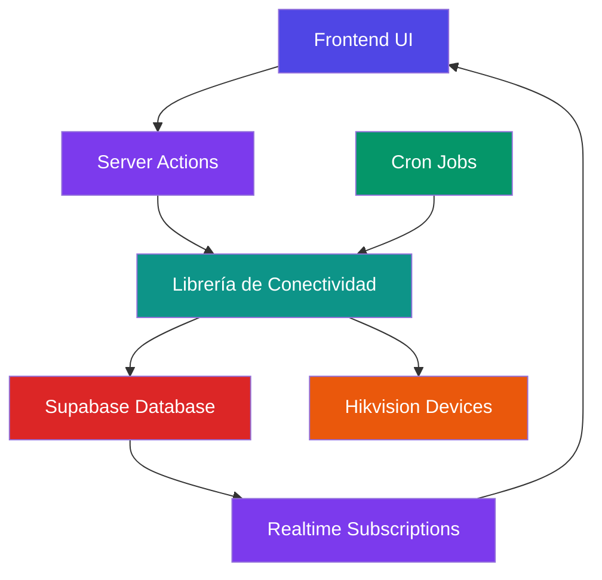

# Arquitectura del Sistema de Conectividad

Documento técnico que describe la arquitectura del sistema de conectividad implementado.

## Diagrama de Arquitectura

## Capas del Sistema

### 1. Capa de Presentación (Frontend)
Componentes React que muestran el estado de conectividad y permiten acciones de verificación:

- `DeviceCard`: Tarjeta individual con botón de verificación
- `ConnectivityCheckButton`: Botón para verificación masiva
- `ConnectivityPage`: Página dedicada de monitoreo
- Dashboard mejorado con resumen de conectividad

### 2. Capa de Lógica de Negocio (Server Actions)
Funciones server-side que manejan las operaciones de conectividad:

- `checkDeviceConnection`: Verifica dispositivo individual
- `checkAllDevicesConnection`: Verifica todos los dispositivos
- `scheduledHealthCheck`: Endpoint para tareas programadas

### 3. Capa de Servicios (Librería de Conectividad)
Lógica principal del sistema implementada en `/src/lib/device-connectivity.ts`:

- `checkDeviceConnectivity`: Verificación real de conectividad
- `updateDeviceStatus`: Actualización del estado en BD
- `checkAllDevices`: Verificación masiva con resumen

### 4. Capa de Datos (Supabase)
Base de datos PostgreSQL con suscripciones Realtime:

- Tabla `devices` con campos de estado
- Campo `last_seen_at` para tracking de actividad
- Suscripciones en tiempo real para actualización automática

### 5. Capa de Integración (Dispositivos Hikvision)
Dispositivos físicos que son verificados mediante:

- Solicitudes HTTP al puerto 80 por defecto
- Manejo de timeout y errores de red
- Parseo de respuestas para determinar estado

## Flujo de Datos

### Verificación Individual
1. Usuario presiona botón "Verificar" en DeviceCard
2. Componente llama a `checkDeviceConnection` server action
3. Server action invoca `checkDeviceConnectivity`
4. Función realiza solicitud HTTP al dispositivo
5. Resultado se guarda en base de datos
6. Interfaz se actualiza mediante Realtime

### Verificación Masiva
1. Usuario presiona "Verificar Conectividad" en toolbar
2. Componente llama a `checkAllDevicesConnection`
3. Server action invoca `checkAllDevices`
4. Función verifica cada dispositivo secuencialmente
5. Estados actualizados en base de datos
6. Dashboard se refresca automáticamente

### Tareas Programadas
1. Cron job ejecuta script cada X minutos
2. Script llama a `runConnectivityCheck`
3. Función verifica todos los dispositivos
4. Estados actualizados en base de datos
5. Posibles notificaciones enviadas

## Patrones de Diseño Utilizados

### 1. Separation of Concerns
Cada capa tiene responsabilidades claramente definidas:

- **UI**: Solo muestra datos y captura interacciones
- **Server Actions**: Orquestan operaciones complejas
- **Librería**: Implementa lógica de negocio pura
- **Datos**: Persistencia y suscripciones

### 2. Single Responsibility Principle
Cada función tiene una única responsabilidad:

- `checkDeviceConnectivity`: Solo verifica conectividad
- `updateDeviceStatus`: Solo actualiza estado
- `checkAllDevices`: Solo coordina verificaciones

### 3. Don't Repeat Yourself (DRY)
Lógica compartida en librería reutilizable:

- Tipos compartidos (`ConnectivityStatus`, `HealthCheckResult`)
- Funciones base reutilizadas por acciones
- Componentes reutilizables (`ConnectivityCheckButton`)

## Escalabilidad

### Horizontal
- Cada dispositivo verificado independientemente
- Tareas programadas pueden distribuirse
- Supabase Realtime maneja múltiples clientes

### Vertical
- Tipos extensibles para nuevos estados
- Facilidad para agregar nuevos métodos de verificación
- Sistema de hooks para notificaciones adicionales

## Seguridad

### Autenticación
- Todas las acciones server-side requieren sesión válida
- Acceso a base de datos mediante cliente autenticado
- Protección de endpoints sensibles

### Validación
- Verificación de tipos en todas las entradas
- Manejo seguro de errores sin exponer detalles internos
- Sanitización de direcciones IP antes de usar

### Autorización
- Acciones solo disponibles para usuarios autenticados
- Futura implementación de roles específicos
- Logs de auditoría para acciones críticas

---
**Última actualización:** April 15, 2026